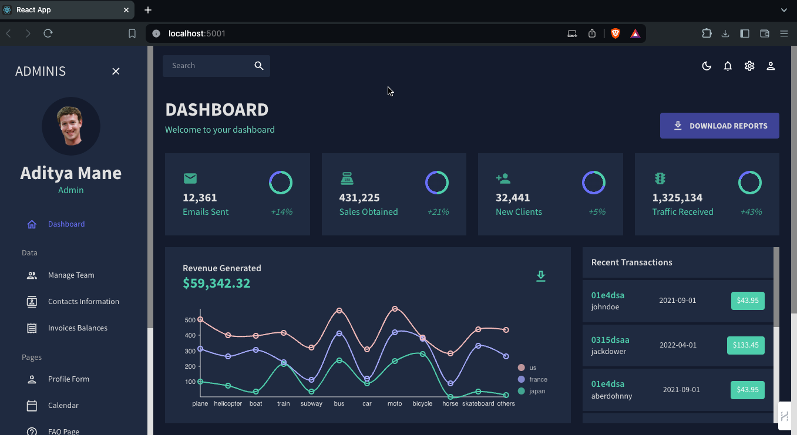
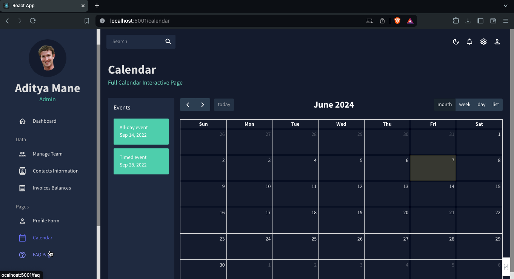

# React Admin Dashboard

Welcome to the React Admin Dashboard project! This project aims to create a versatile and highly customizable admin dashboard application with features like theming, tables, charts, a calendar, and a Kanban board. The app is designed to provide a seamless user experience with interactive features and smooth integration.

## Features

- **Customizable Themes**: Easily switch between different themes using Material-UI.
- **Dynamic Tables**: Interactive and responsive tables with sorting and filtering capabilities.
- **Charts**: Variety of charts to visualize data effectively.
- **Calendar**: Integrated calendar to manage events.
- **Interactive UI**: Smooth and responsive user interactions with Material-UI components.


## Screenshots







## Built With

- [React](https://reactjs.org/)
- [Material-UI](https://mui.com/)
- [Formik](https://formik.org/)
- [Chart.js](https://www.chartjs.org/)
- [FullCalendar](https://fullcalendar.io/)


## Getting Started

To get a local copy up and running follow these simple steps.

### Prerequisites

Make sure you have the following installed:

- Node.js
- npm (or yarn)

### Installation

1. Clone the repo

   ```sh
   git clone https://github.com/adityas-github/react-admin.git
   ```

2. Install NPM packages

   ```sh
   cd react-admin
   npm install
   ```

3. Start the development server

   ```sh
   npm start
   ```

4. Open [http://localhost:3000](http://localhost:3000) to view it in your browser.

## Usage

### Customizing Themes

To customize themes, you can modify the theme configuration files located in the `src/themes` directory. The theme provider setup in Material-UI allows for easy addition of new themes.

### Tables

The tables are built with Material-UI's table components and `@mui/x-data-grid`. Refer to the [Material-UI Table documentation](https://mui.com/components/tables/) and the [DataGrid documentation](https://mui.com/components/data-grid/) for advanced customization options.

### Charts

Charts are implemented using [Chart.js](https://www.chartjs.org/) with [react-chartjs-2](https://github.com/reactchartjs/react-chartjs-2). Customize charts in the `src/components/Charts` directory.

### Calendar

The calendar component uses [FullCalendar](https://fullcalendar.io/) with the following packages:
- `@fullcalendar/core`
- `@fullcalendar/react`
- `@fullcalendar/daygrid`
- `@fullcalendar/timegrid`
- `@fullcalendar/list`

Events can be managed through the state management setup in the application.

### Forms

Forms are built using [Formik](https://formik.org/) and [Yup](https://github.com/jquense/yup) for validation. Refer to their documentation for advanced form handling and validation techniques.

### Routing

The application uses [react-router-dom](https://reactrouter.com/) for client-side routing. Customize the routes in the `src/routes` directory.

### Sidebar

The sidebar is implemented using [react-pro-sidebar](https://github.com/azouaoui-med/react-pro-sidebar). Customize the sidebar in the `src/components/Sidebar` directory.
